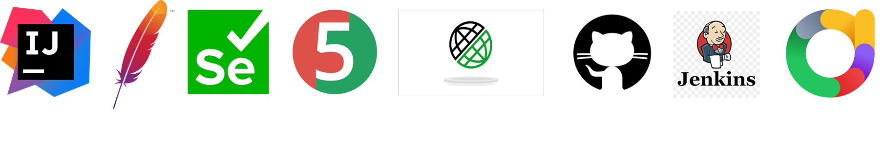

# Автоматизированный фреймворк для тестирования веб-сайта [pinterest.com](https://www.pinterest.com//)
**pinterest.com – платформа для обмена изображениями и идеями**

___

## Содержание:
- Технологии и инструменты
- Реализованные проверки

___

## Технологии и инструменты

- Maven - для сборки проекта
- JUnit 5 - для написания и выполнения тестов
- Selenium - для автоматизации пользовательского интерфейса
- Rest-Assured - для тестирования API
- JavaFaker - для генерации фейковых данных
- Log4j - для логирования информации о тестах
- Allure - для генерации отчетов
- Jenkins - для удаленного запуска по времени реализована job с формированием Allure-отчета

___

## Реализованные проверки

**UI тесты:**
- [x] Валидация формы Авторизации
- [x] Авторизация на сайте
- [x] Проверка цвета элементов формы Авторизация
- [x] Валидация формы Регистрация
- [x] Регистрация на сайте
- [x] Проверка цвета элементов формы Регистрация

**API тесты:**
- [x] Авторизация пользователя
- [x] Регистрация пользователя
- [x] Строка поиска 

___
